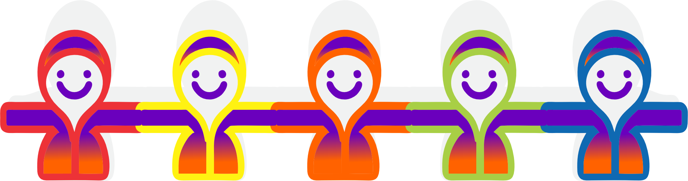

# 👗 7Lagoas Doação Solidária 👕

## 🎉 Bem-vindo ao 7Lagoas Doação Solidária! 🎉

Este é o repositório oficial do 7Lagoas Doação Solidária, um aplicativo dedicado a facilitar a doação de roupas na cidade de Sete Lagoas - MG. Aqui, você pode explorar o código-fonte, colaborar no desenvolvimento e contribuir para fazer a diferença na vida de muitas pessoas!

## Apresentação da Proposta 📃

Você pode acessar a proposta do trabalho clicando [aqui](https://github.com/seu-usuario/seu-repositorio/raw/main/docs/Proposta_Projeto.pdf).

### 📱 Visão Geral do Projeto

7Lagoas Doação Solidária é uma plataforma que conecta doadores e beneficiários de roupas, facilitando a distribuição de vestuário para aqueles que mais precisam. Através de uma interface intuitiva e fácil de usar, nosso objetivo é promover a solidariedade e a sustentabilidade na comunidade de Sete Lagoas.

### 🛠️ Tecnologias Utilizadas

Este projeto utiliza as seguintes tecnologias e ferramentas:

🌐 HTML - Estruturação das páginas.

🎨 CSS - Estilização e design visual.

⚙️ JavaScript - Funcionalidades dinâmicas e interatividade.

🔤 Google Fonts - Tipografias atraentes e de fácil leitura.

🖼️ Freepik - Imagens e vetores para ilustrações e design.

✒ CorelDraw - Arte edição e criação de designs.

### 🚀 Funcionalidades Principais

Cadastro de Doações: Permite que os usuários cadastrem as roupas que desejam doar.

Busca de Necessidades por pedido: Facilitando que quem precisa encontre uma possível ajuda.

Geolocalização: Ajuda os doadores e beneficiários a encontrarem pontos de coleta e entrega.
(não implementado ainda)

Notificações em Tempo Real: Avisos instantâneos para novos pedidos e ofertas de doações.

### 🛠️ Como Configurar o Projeto Localmente

Clone o repositório:

bash

Copiar código

git clone https://github.com/seuusuario/7lagoas-doacao-solidaria.git

Navegue até o diretório do projeto:

bash

Copiar código

cd 7lagoas-doacao-solidaria

Abra o arquivo index.html em seu navegador para visualizar a interface inicial.

### 🤝 Contribuindo

Contribuições são bem-vindas! Se você deseja colaborar com o projeto, siga os passos abaixo:

Faça um fork do repositório.

Crie uma branch para sua feature (git checkout -b feature/nome-da-feature).

Commit suas alterações (git commit -m 'Adiciona nova feature').

Envie para o branch (git push origin feature/nome-da-feature).

Abra um Pull Request para revisão.

### 🌍 Links Importantes

...

### 💬 Contato

Se você tiver alguma dúvida ou sugestão, sinta-se à vontade para entrar em contato conosco:

Email: 4298040@alunouninter.com

## 💜 Obrigado por visitar este repositório e apoiar a nossa causa! 🧡 
